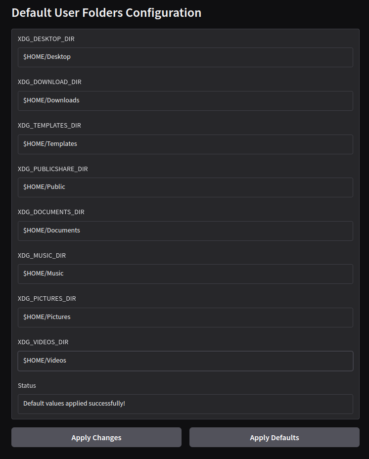

# UbuntuDefaultFolders
Status: Working.

## Description
UbuntuDefaultFolders is a graphical tool that allows users to view and modify their default Ubuntu folder locations (like Documents, Downloads, Pictures, etc.) through a simple interface, without needing to manually edit the configuration file located at ~/.config/user-dirs.dirs. Changes made through the interface are saved directly to the system configuration.

### Features
- Displays all current default folder locations in an easy-to-read format
- Allows direct editing of folder paths through text input fields
- Saves changes to the system's user-dirs configuration file automatically
- Provides immediate feedback on successful changes through status messages
- Runs with user permissions (no sudo required) while maintaining system file security

### Preview

## Requirements 
- I used Ubuntu 24.10 - if using other version, ensure the config file is at `~/.config/user-dirs.dirs`.
- Python 3.x - All requirements are installed via option in the bash menu.

### Instructions
- Download or clone the repository to a sensible folder.
- Ensure the launcher executable if not already `chmod +x UbuntuDefaultFolders-Launcher.sh`.
- Run the launcher `./UbuntuDefaultFolders-Launcher.sh`.
- Select option 1 to install requirements (first time only) (installs to ./venv).
- Select option 2 to run the program (it will use the venv, and a Gradio interface will popup).
- Edit folder paths as needed in the browser window that pops up, and click "Apply Changes".
- Restart your system for changes to take effect.

## Notation
- If you, are going to swap around drives or mess things up or want to revert changes, then you have the option to `Apply Defaults`.

